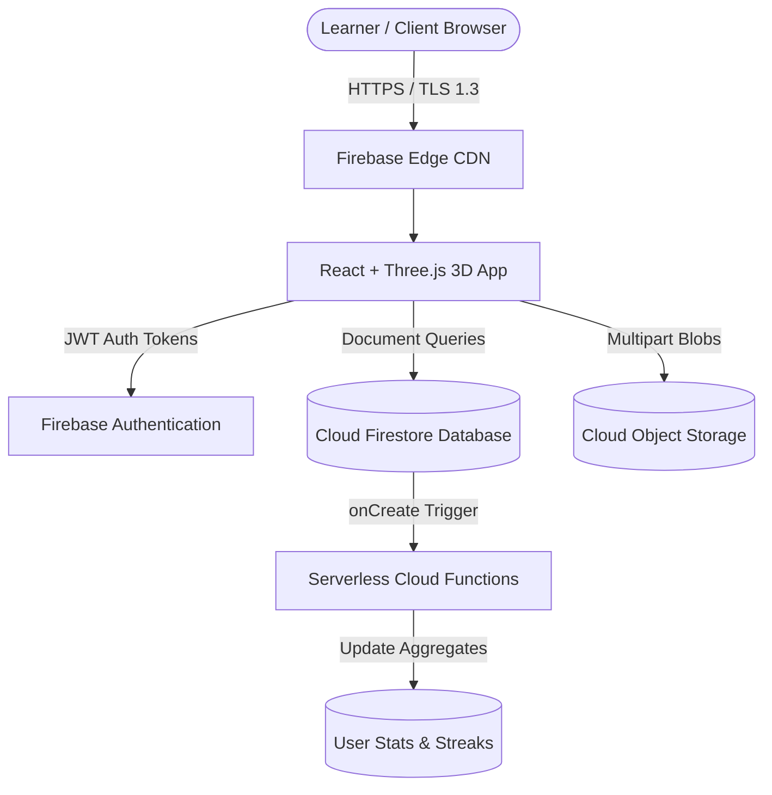

# SkillSphere 3D: Online Hobby & Skills Tracker with Community Sharing on Cloud


> A modern, cloud-native 3D platform where lifelong learners log structured practice sessions, build compounding streaks, store verified proof in Cloud Object Storage, and celebrate milestone triumphs on a real-time community feed.

---

## 🚀 Live Demo & Independent Deployment

- **Live Cloud URL**: [https://skillsphere-3d-cloud.web.app](https://skillsphere-3d-cloud.web.app) *(or your Vercel/Firebase edge instance)*
- **Offline / Local Sandbox**: Automatically falls back to high-fidelity in-browser persistence with preloaded synthetic datasets if cloud API keys are absent, ensuring zero-friction evaluation.

---

## 🌟 Key Highlights & 3D Immersion

- **Interactive 3D Skill Galaxy Canvas**: Powered by Three.js WebGL with orbiting skill nodes, metallic wireframe torus cores, and mouse parallax responsiveness.
- **Dynamic Skill-Specific 3D Tilt Cards**: Each inserted hobby renders a unique thematic animation:
  - **Coding**: Cyberpunk terminal matrix grid with cyan circuit pulses.
  - **Music / Guitar**: Sunset amber soundwave frequency equalizer and acoustic ring.
  - **Photography**: Optical camera iris aperture ring with pink shutter flare.
  - **Fitness**: Emerald cardio heartbeat ECG pulse and kinetic power ring.
  - **Art / Painting**: Chromatic paint swirl orb with multi-color particle stream.
  - **Cooking / Chess / Gardening**: Themed geometric badges with interactive glowing highlights.
- **Automated Streak Engine**: Calculates consecutive-day consistency; multiple same-day sessions prevent duplicate streak inflation, while multi-day lapses reset streaks.
- **Cloud Object Storage Pipeline**: Validates file types and sizes (< 5MB) for proof of practice and certificates, decoupled from structured database records.
- **Real-Time Community Feed**: Post progress updates, attachment previews, idempotent like toggling, and nested comments.
- **Serverless Event Hooks**: Cloud Functions trigger on log entries to recompute weekly minutes and unlock milestone badges.

---

## 🏛️ Cloud Architecture Overview



### Cloud Concepts Demonstrated

| Concept | Implementation in SkillSphere 3D |
| :--- | :--- |
| **SaaS** | Complete cross-device responsive 3D web application accessible globally. |
| **PaaS** | Google Cloud Firebase Hosting automating SSL certificates, compression, and edge CDN. |
| **Serverless (FaaS)** | Cloud Functions triggered on practice creation (`onLogCreate`) and weekly recap cron jobs. |
| **Cloud Database** | NoSQL Firestore with collection partitioning (`/users/{uid}/skills`, `/posts/{id}`). |
| **Cloud Object Storage** | Google Cloud Storage (GCS) storing proof files and certificates decoupled from DB records. |
| **Security & RBAC** | Granular Firestore Security Rules ensuring users can only mutate their own records. |
| **Event-Driven Compute** | Asynchronous streak calculations without blocking client network latency. |

---

## 🛠️ Technology Stack

- **Frontend**: React 18, Three.js, Lucide Icons, Canvas Confetti, Tailwind CSS, Vite
- **Cloud Backend**: Firebase Authentication, Cloud Firestore, Cloud Storage, Cloud Functions
- **Alternative Backend**: Python FastAPI, Pydantic, Uvicorn, Docker (Cloud Run ready)
- **Deployment**: Firebase Hosting & Vercel Free-Tier

---

## ⚡ Quick Start & Local Simulation

### 1. Clone & Install Dependencies
```bash
git clone https://github.com/your-username/Cloud-Hobby-Skills-Tracker.git
cd Cloud-Hobby-Skills-Tracker/frontend
npm install
```

### 2. Run Local Development Server
```bash
npm run dev
```
Open [http://localhost:3000](http://localhost:3000). The app immediately boots with preloaded synthetic data.

### 3. Run Automated Engine Unit Tests
```bash
node tests/test_streak_engine.js
```

---

## 🌐 1-Click Cloud Deployment (Free Tier)

### Step 1: Install Firebase CLI & Login
```bash
npm install -g firebase-tools
firebase login
```

### Step 2: Initialize & Build
```bash
firebase init
# Select Hosting, Firestore, Storage, and Functions
npm --prefix frontend run build
```

### Step 3: Deploy to Cloud
```bash
firebase deploy
```
Your application will be live at `https://<your-project-id>.web.app`.

---

## 📂 Project Structure

```
skillsphere-3d/
├── frontend/
│   ├── src/
│   │   ├── components/
│   │   │   ├── 3d/
│   │   │   │   ├── HeroScene.jsx          # Interactive 3D WebGL Galaxy
│   │   │   │   ├── SkillCard3D.jsx        # Dynamic 3D tilt cards by category
│   │   │   │   └── CelebrationCanvas.jsx  # Milestone fireworks
│   │   │   └── common/
│   │   │       ├── Navbar.jsx             # Responsive glassmorphic navigation
│   │   │       ├── PracticeLogModal.jsx   # Practice logger with proof upload
│   │   │       └── AddSkillModal.jsx      # New skill provisioning
│   │   ├── pages/
│   │   │   ├── Dashboard.jsx              # Streaks, charts, and 3D hero
│   │   │   ├── SkillsGalaxy.jsx           # Filtered 3D skill portfolio
│   │   │   ├── CommunityFeed.jsx          # Real-time posts, likes, comments
│   │   │   ├── CloudArchitecture.jsx      # Academic cloud topology showcase
│   │   │   └── AuthPage.jsx               # Cloud login & registration
│   │   ├── context/AuthContext.jsx        # Authentication provider
│   │   ├── firebase/
│   │   │   ├── config.js                  # Cloud client SDK initialization
│   │   │   ├── firestore.rules            # Database RBAC security rules
│   │   │   └── storage.rules              # Object storage MIME & size rules
│   │   └── services/
│   │       ├── dataService.js             # Firestore & storage operations
│   │       └── mockData.js                # Synthetic dataset seeds
├── functions/
│   ├── index.js                           # Cloud Function streak engine & cron
│   └── package.json
├── backend/
│   ├── app.py                             # Python FastAPI alternative backend
│   ├── Dockerfile                         # Cloud Run container deployment
│   └── requirements.txt
├── tests/
│   └── test_streak_engine.js              # Automated unit tests
├── docs/                                  # Full academic report, testing matrix, interview prep
├── firebase.json                          # Firebase deployment orchestration
└── README.md
```

---

## 📜 Academic Project Report & Interview Guide

- [Complete Project Report](docs/PROJECT_REPORT.md)
- [Testing Matrix (27 Test Cases)](docs/TESTING_MATRIX.md)
- [14-Day Git Commit Strategy](docs/COMMIT_HISTORY_STRATEGY.md)
- [10 Technical Interview Questions & Answers](docs/INTERVIEW_PREP.md)
- [Resume & LinkedIn Bullet Points](docs/RESUME_LINKEDIN_GUIDE.md)

---

## 👤 Author & Acknowledgments

- **Lead Developer**: Cloud Computing Capstone Candidate
- **Course**: Cloud Computing & Distributed Systems
- **License**: MIT
